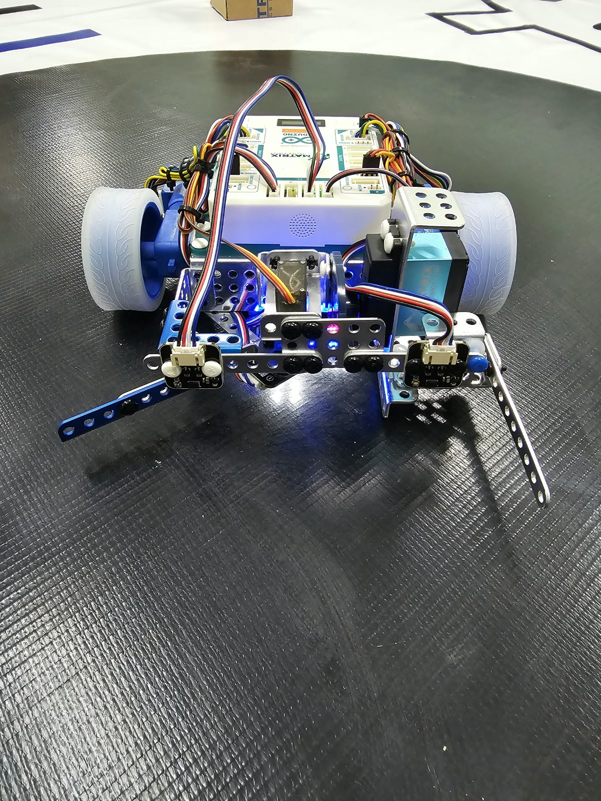
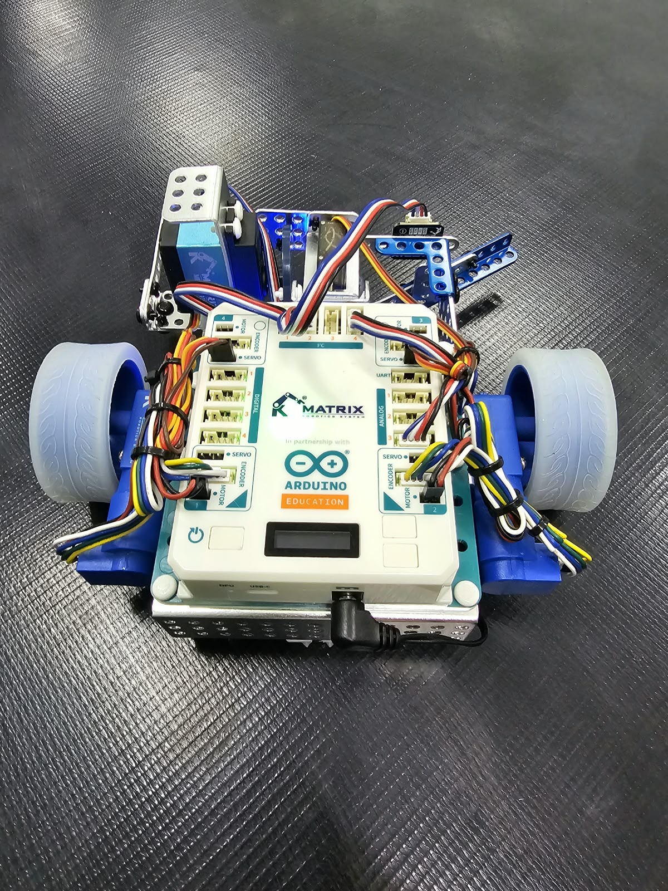
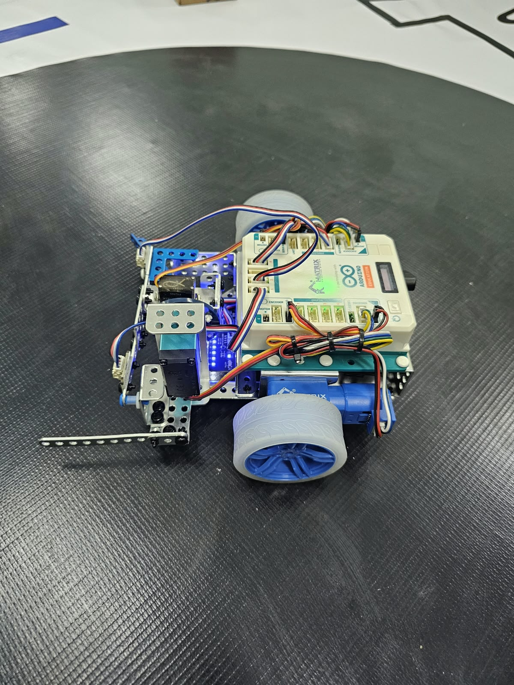
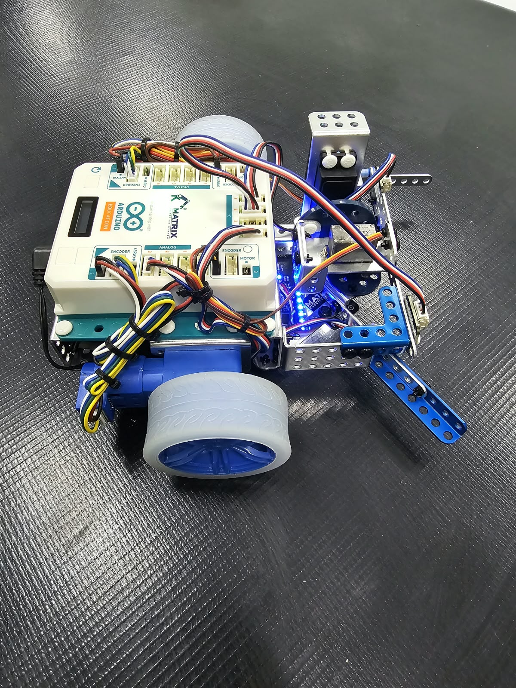
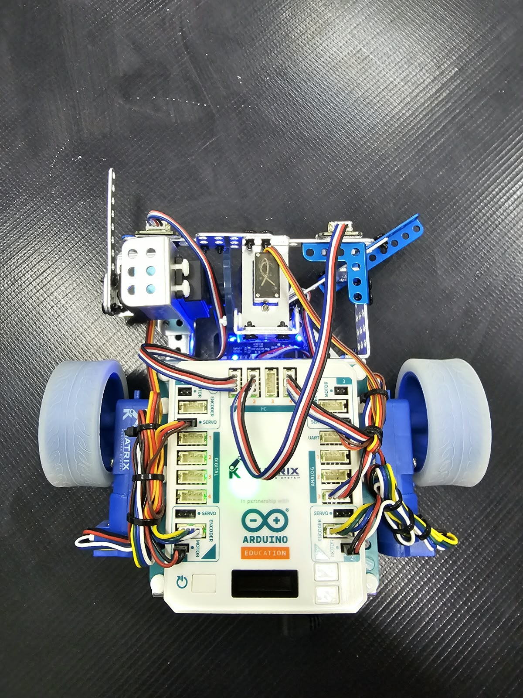
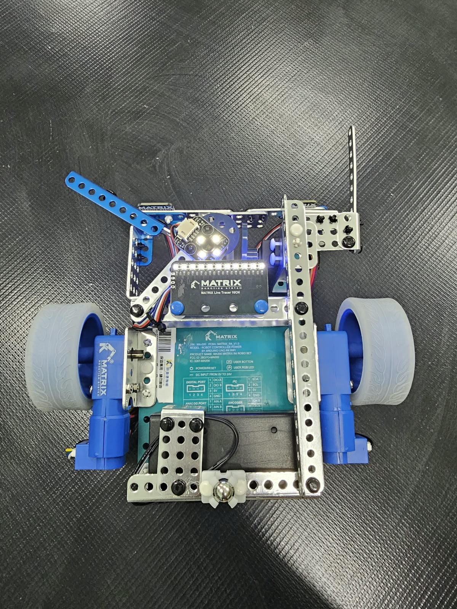

# BotON-2026
# 🤖 Robot MATRIX R4 – Plataforma de Robótica Educativa

Robot móvil desarrollado sobre la plataforma **MATRIX R4**, diseñado para aplicaciones de robótica educativa, navegación autónoma, seguimiento de líneas y detección de obstáculos.

El robot utiliza una combinación de sensores ópticos, sensores láser y motores con encoder, permitiendo implementar algoritmos de navegación, control de velocidad, seguimiento de trayectoria y toma de decisiones autónomas.

## 🛠️ Componentes principales

- 🧠 **Controlador:** MATRIX R4 / Arduino R4 WiFi
- ⚙️ **2 motores DC con encoder**
- 🎨 **1 sensor de color**
- 📡 **2 sensores láser de distancia**
- 🛣️ **1 sensor seguidor de línea de 10 canales**
- 🔋 Sistema de alimentación integrado
- 🔧 Estructura mecánica para navegación autónoma

## 🔍 Full View — All Angles

| Front | Back |
|:---:|:---:|
|  |  |

| Left Side | Right Side |
|:---:|:---:|
|  |  |

| Top | Bottom |
|:---:|:---:|
|  |  |
## 📡 Sensores

### 🎨 Sensor de Color
Utilizado para detectar diferentes colores presentes en la pista y permitir que el robot ejecute acciones específicas según el color identificado.

Aplicaciones:
- Detección de zonas de la pista
- Identificación de señales
- Toma de decisiones
- Detección de puntos de control

### 📏 Sensores Láser

El robot incorpora **dos sensores láser de distancia**, utilizados para detectar obstáculos y medir la distancia respecto a objetos del entorno.

Aplicaciones:
- Detección de obstáculos
- Control de distancia
- Navegación autónoma
- Corrección de trayectoria

### 🛣️ Seguidor de Línea de 10 Canales

El sensor de línea de 10 canales permite obtener información detallada sobre la posición de la línea respecto al robot.

Esto permite implementar algoritmos como:

- Seguimiento proporcional (P)
- Control PD
- Control PID
- Corrección de trayectoria
- Detección de intersecciones

## ⚙️ Motores con Encoder

El robot utiliza **dos motores DC con encoder**, permitiendo conocer el movimiento de cada rueda y realizar un control más preciso.

Los encoders pueden utilizarse para:

- Medición de velocidad
- Control de RPM
- Control de distancia recorrida
- Odometría
- Sincronización de motores
- Control PID de velocidad

## 🧠 Funciones del Robot

El sistema está diseñado para implementar diferentes comportamientos autónomos:

1. Seguimiento de líneas.
2. Detección de obstáculos.
3. Navegación autónoma.
4. Detección de colores.
5. Control de velocidad mediante encoders.
6. Corrección automática de trayectoria.
7. Toma de decisiones basada en sensores.

## 🏆 Aplicaciones

Esta plataforma puede utilizarse en:

- 🤖 Competiciones de robótica
- 🏫 Robótica educativa
- 🧪 Prácticas de control automático
- 🛣️ Seguimiento de líneas
- 📡 Navegación autónoma
- 🧠 Algoritmos de inteligencia artificial
- ⚙️ Sistemas de control PID

## 💻 Programación

El robot puede ser programado mediante el entorno compatible con **Arduino/MATRIX**, utilizando código C/C++ para controlar motores, sensores y algoritmos de navegación.
